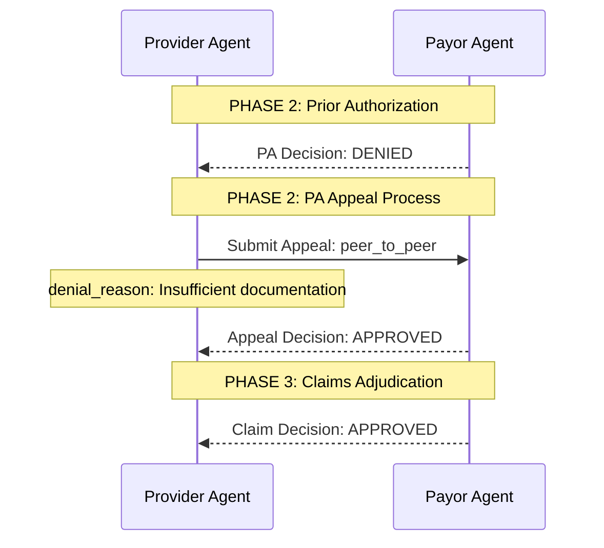

# Audit Log System for LLM Interactions

## Overview

The audit log system captures all LLM prompts and responses between Provider and Payor agents during the utilization review simulation. This provides full transparency and reproducibility for research analysis.

## Key Features

- **Full Prompt Capture**: Records both system and user prompts sent to LLMs
- **Response Logging**: Captures raw LLM responses and parsed structured outputs
- **Phase Organization**: Groups interactions by workflow phase (PA, Appeals, Claims)
- **Agent Attribution**: Tracks which agent (Provider/Payor) initiated each interaction
- **Metadata Tracking**: Stores contextual information (iteration numbers, denial reasons, etc.)
- **JSON Export**: Saves audit logs in structured JSON format for analysis
- **Mermaid Diagrams**: Automatically generates sequence diagrams visualizing the workflow

## Architecture

### Core Components

1. **LLMInteraction** (`src/models/schemas.py`)
   - Single prompt-response interaction
   - Fields: system_prompt, user_prompt, llm_response, parsed_output, metadata

2. **AuditLog** (`src/models/schemas.py`)
   - Complete log for a case simulation
   - Contains list of LLMInteractions + summary statistics

3. **AuditLogger** (`src/utils/audit_logger.py`)
   - Utility class for logging interactions
   - Methods: log_interaction(), finalize(), save_to_json()

4. **MermaidAuditGenerator** (`src/utils/mermaid_audit_generator.py`)
   - Generates Mermaid sequence diagrams from audit logs
   - Creates visual abstractions of agent interactions

### Workflow Phases

The audit log organizes interactions by phase:

- **phase_2_pa**: Prior authorization review (before treatment)
- **phase_2_pa_appeal**: PA appeal process (if PA denied)
- **phase_3_claims**: Claims adjudication (after treatment delivered)
- **phase_4_financial**: Financial settlement calculations

## Usage

### Running Simulations with Audit Logging

Audit logging is automatically enabled for all simulations:

```python
from src.simulation.game_runner import UtilizationReviewSimulation
from src.data.infliximab_crohns_case import get_infliximab_case
from src.data.case_converter import convert_case_to_models

# Get case and run simulation
case = get_infliximab_case()
case = convert_case_to_models(case)

sim = UtilizationReviewSimulation(azure_config=azure_config)
result = sim.run_case(case)

# Access audit log
audit_log = result.audit_log
print(f"Total interactions: {audit_log.summary['total_interactions']}")
```

### Exporting Audit Logs

```python
import json

# Save to JSON file
with open('audit_log.json', 'w') as f:
    json.dump(result.audit_log.model_dump(), f, indent=2)
```

### Generating Mermaid Diagrams

```python
from src.utils.mermaid_audit_generator import MermaidAuditGenerator

# Generate and save Mermaid diagram
MermaidAuditGenerator.save_from_state(result, 'workflow_diagram.mmd')

# Or generate diagram string
diagram = MermaidAuditGenerator.generate_from_encounter_state(result)
print(diagram)
```

### Example Output

See `examples/audit_log_example.py` for a complete working example.

Run it with:
```bash
python examples/audit_log_example.py
```

This generates:
- `outputs/example_audit_log.json`: Full audit log with all prompts/responses
- `outputs/example_workflow.mmd`: Mermaid sequence diagram

## Audit Log Structure

### LLMInteraction Fields

```json
{
  "interaction_id": "phase_2_pa_payor_pa_decision_abc123",
  "timestamp": "2025-11-05T06:03:43.665779",
  "phase": "phase_2_pa",
  "agent": "payor",
  "action": "pa_decision",
  "system_prompt": "You are a PAYER reviewing a medication PA request.",
  "user_prompt": "Full prompt text with patient data...",
  "llm_response": "Raw JSON response from LLM...",
  "parsed_output": {
    "authorization_status": "denied",
    "denial_reason": "Insufficient documentation",
    "criteria_used": "Step therapy protocol"
  },
  "metadata": {
    "medication": "Infliximab"
  }
}
```

### AuditLog Fields

```json
{
  "case_id": "infliximab_crohns_2015",
  "simulation_start": "2025-11-05T06:03:43.665750",
  "simulation_end": "2025-11-05T06:03:43.665850",
  "interactions": [...],
  "summary": {
    "total_interactions": 4,
    "interactions_by_phase": {
      "phase_2_pa": 1,
      "phase_2_pa_appeal": 2,
      "phase_3_claims": 1
    },
    "interactions_by_agent": {
      "provider": 1,
      "payor": 3
    },
    "simulation_duration_seconds": 0.0001
  }
}
```

## Mermaid Diagram Example



## Research Applications

### Behavioral Analysis

The audit log enables analysis of:

1. **Adversarial Dynamics**
   - Track PA denial → appeal → overturn patterns
   - Measure trust erosion (PA approved → claim denied)
   - Identify defensive documentation strategies

2. **AI Arms Race Patterns**
   - Compare prompt complexity over time
   - Analyze LLM reasoning in denials vs approvals
   - Study prompt engineering strategies by both agents

3. **System-Level Validation**
   - Aggregate interaction counts across 15-20 cases
   - Calculate population-level metrics (denial rates, appeal rates)
   - Validate against Medicare Advantage benchmarks

### Prompt Analysis

Extract and analyze prompts for:
- Length and complexity trends
- Guideline citation patterns
- Evidence presentation strategies
- Reasoning quality in LLM responses

### Reproducibility

The audit log provides:
- Exact prompts used in published results
- Full LLM responses for verification
- Timestamp-based execution tracking
- Version control for prompt engineering

## Implementation Details

### Integration Points

Audit logging is integrated at these points in `game_runner.py`:

1. **Initialization** (`run_case` method)
   - Creates `AuditLogger` instance
   - Stores in `self.audit_logger`

2. **PA Review** (`_phase_2_medication_pa`)
   - Logs payor PA decision
   - Logs provider appeal (if denied)
   - Logs payor appeal decision

3. **Claims Adjudication** (`_phase_3_medication_claims`)
   - Logs payor claim decision

4. **Finalization** (`run_case` method)
   - Calls `audit_logger.finalize()`
   - Attaches audit log to encounter state

### Adding New Interactions

To log a new LLM interaction:

```python
# After LLM call
response = agent.llm.invoke(messages)
response_text = response.content

# Log the interaction
self.audit_logger.log_interaction(
    phase="phase_name",  # e.g., "phase_2_pa"
    agent="provider" or "payor",
    action="action_name",  # e.g., "pa_decision"
    system_prompt="System prompt text",
    user_prompt=prompt_variable,
    llm_response=response_text,
    parsed_output=parsed_dict,
    metadata={"key": "value"}  # Optional context
)
```

## Files Reference

### Core Files
- `src/models/schemas.py`: LLMInteraction, AuditLog schemas
- `src/utils/audit_logger.py`: AuditLogger class
- `src/utils/mermaid_audit_generator.py`: Diagram generation
- `src/simulation/game_runner.py`: Integration points

### Examples
- `examples/audit_log_example.py`: Complete working example
- `tests/test_audit_log.py`: Test with infliximab case

### Outputs
- `outputs/example_audit_log.json`: Example audit log
- `outputs/example_workflow.mmd`: Example Mermaid diagram

## Future Enhancements

Potential additions to the audit log system:

1. **Performance Metrics**
   - Track LLM response times
   - Monitor token usage per interaction
   - Calculate cost per case

2. **Validation Hooks**
   - Automatic schema validation
   - Prompt template verification
   - Response format checking

3. **Analysis Tools**
   - Prompt diff visualization
   - Response clustering
   - Adversarial pattern detection

4. **Export Formats**
   - CSV for statistical analysis
   - HTML reports with visualizations
   - LaTeX tables for papers
